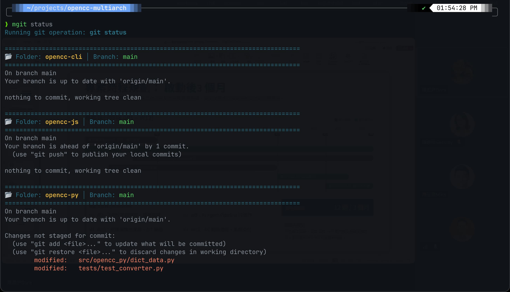

# mgit

`mgit` 是一個簡單且實用的 Bash/Zsh 腳本，旨在協助開發者快速對當前目錄下的所有 Git 子目錄執行相同的 Git 指令。


## 功能描述
當你在包含多個 Git 專案的資料夾中使用此腳本時，它會自動遍歷所有直接子目錄，並檢查該目錄是否為 Git 儲存庫（包含 `.git` 資料夾或檔案）。若確認是 Git 儲存庫，則會針對該目錄執行指定的 Git 指令。

## 安裝方式

### 單行指令安裝 (One-line Install)
你可以直接在終端機中執行以下指令進行自動安裝：

**Bash/Zsh / macOS / Linux**:
```bash
curl -fsSL https://raw.githubusercontent.com/doggy8088/mgit/main/install.sh | bash
```

**PowerShell / Windows / Cross-platform**:
```powershell
irm https://raw.githubusercontent.com/doggy8088/mgit/main/install.ps1 | iex
```

### 手動安裝
或者是複製專案後執行安裝腳本：

**Bash/Zsh**:
```bash
git clone https://github.com/doggy8088/mgit.git
cd mgit
./install.sh
```

**PowerShell**:
```powershell
git clone https://github.com/doggy8088/mgit.git
cd mgit
.\install.ps1
```

## 使用方式

將腳本安裝或放置在你的專案根目錄，並透過終端機執行：

### 1. 預設行為
如果不帶任何參數執行，腳本會預設執行 `git status -s`：
```bash
mgit
```

### 2. 自訂 Git 指令
你可以傳遞任何標準的 Git 指令參數，例如：
```bash
mgit pull
mgit log -n 1
mgit checkout main
```

## PowerShell 支援

本專案同時提供 `mgit.ps1` 供 Windows PowerShell 或 PowerShell Core (`pwsh`) 使用。

### 使用方式
```powershell
.\mgit.ps1
.\mgit.ps1 pull
.\mgit.ps1 log -n 1
```

## 畫面截圖


## 腳本特點
*   **自動化**：自動篩選出包含 `.git` 的子目錄，忽略非 Git 專案目錄。
*   **視覺化回饋**：使用 ANSI 顏色代碼輸出，讓執行結果更易於閱讀。
*   **靈活性**：支援所有標準 Git 指令，操作與原生 Git 無異。

## 注意事項
*   請確保該腳本具有執行權限（如果手動放置）：
    ```bash
    chmod +x mgit
    ```
*   該腳本目前僅會掃描當前目錄下的「第一層」子目錄。
